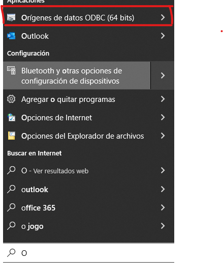
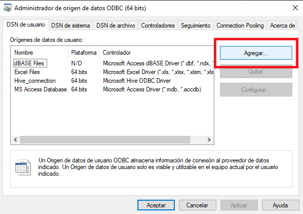
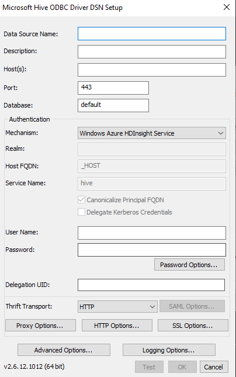
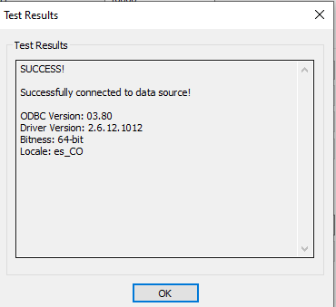
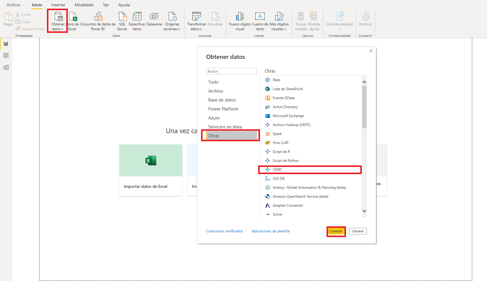
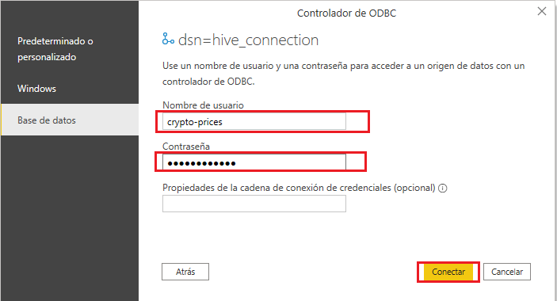
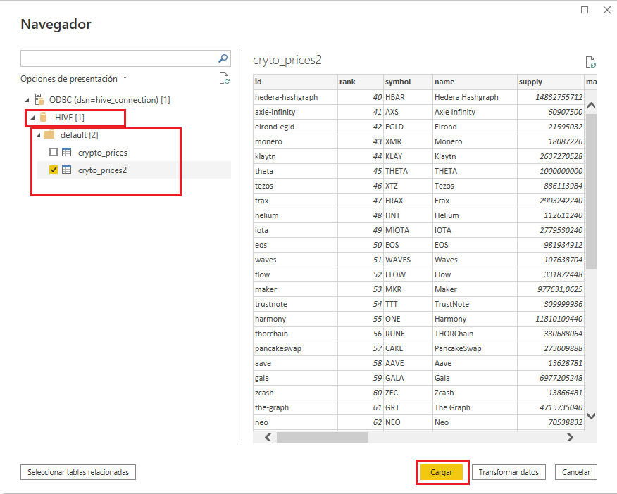

# Big Data Streaming Stack

Big Data Streaming Stack es un conjunto de tecnologías unificadas con Docker Compose cuyo
proposito es facilitar el aprendizaje de algunas tecnologías como Delta Lake en modo on-premise.

## Dependencias

- Docker 20.10.7
- Docker Compose 1.29.2

**Nota**: Se recomienda usar docker en alguna distribución de linux para mayor agilidad al momento
de instalar el stack.

## Inicio Rápido

Clonar o descargar el repositorio:

`git clone https://github.com/santiagomj/Big-Data-Streaming-Stack.git`

Acceder por consola o algún ambiente de desarrollo a la carpeta donde fue descargado
el repositorio y ejecutar docker compose:

`docker-compose up`

Creación de usuario Apache Superset

`docker exec -it superset superset-init`

## Servicios locales

- Control Center: <http://localhost:9021>
- Jupyter Notebook: <http://localhost:8888>
- Hue: <http://localhost:8889>
- Superset: <http://localhost:8088>
- Minio: <http://localhost:9001>

## Conexión con Power BI 📊 y Hive SQL 🐝

Este apartado es para aquellos usuarios que no desean  usar super set
si no power BI, para ello debemos hacer unas configuraciones adicionales:

### Instalación del ODBC (Open DataBase Connectivity)

Esta utilidad nos servirá para conectarnos a  cualquier
base de datos sin importar el gestor que esté maejando la
aplicación.

Procedemos a descargar la utlidad en el siguiente link:

- <https://www.microsoft.com/en-us/download/details.aspx?id=40886>

Le damos click  en descargar y e instalamos, luego en windows nos vamos para la barra de tareas y en la barra de busqueda colocamos:

"Origenes de datos ODBC (64 bits)"

Una vez abierto la aplicacion le damos en add... o agregar:

Nos saldrá un cuadro con los drivers que tenemos disponibles para
realiazar la conexión, debemos de fijarnos en el que diga
**Microsoft Hive ODBC driver** y le damos click en finalizar.

Acontinuación nos aparecerá una ventaja con estas caracteristicas:

Los campos que nos interesan son:

- **Data Source Name:** el cual tendrá el nombre de nuestra conexión, es
recomendable que sea memotecnico para  diferenciar los diferentes tipos de conexiones.

    Para este caso le colocamos **Hive_Connection**.

- **Host(s):** Allí irá el host donde está localizado tu servicio de bases de datos.

    Como el proyecto se está trabajando en docker, es importante tener en cuenta donde está ubicado el host del servcio y el puerto.

    en este caso el host es: **localhost** y el puerto es: **10000**.

- **Database:** Aqui va el nombre de la Base de datos, por defecto es default, sin embargo si tienen una base de datos con un nombre diferente este debe de ir en este apartado.

- **Authentication/Mechanism:** Si su servicio posee algun tipo de autenticación especifica se debe de seleccionar alguna de las opciones con la se está auntenticando tu servicio.

    Para este caso es : **Username**

Los demas campos se dejan en blanco y procedemos a realizar click en **test**

si la conexión fue exitosa nos aparecerá un cuadro de texto con un **succes!**

Hecho esto le damos en **Ok**  y **Aceptar**, el gestor se cierra automaticamente.

### Conexión con power BI Y OBDC 📊

Procedemos con la creación de un nuevo proyecto en Power BI desktop.

Luego le damos click a obtener Datos, Otras, buscamos OBDC y conectar:

Nos aparecerá un cuadro pidiendonos usuario y contraseña.
Para ello es importante revisar en el [docker-compose.yml](docker-compose.yml) en el servicio llamado hive-server,
encuentras unas variables de entorno llamadas **HDFS_CONF_fs_s3a** en ellas encuentras una con **access_key** y **secret_key**, las cuales juegan el papel del usuario y password respectivamente, con esta información puedes realizar la conexión.

- **username**: crypto-prices.
- **password**: crypto-prices.

**IMPORTANTE**: Las tablas que se ven a continuación, no estan definidas inicialmente en el Docker Compose, por lo que inicialemnte, no existirá ninguna tabla en la base de datos "default". dichas tablas se pueden crear con Apache Hive (Desde la interfaz de Hue) como tablas externas, en el archivo commands.txt se encuentran algunos comandos que pueden ser de ayuda para crear tablas externas.

No saldrá el navegador, desde allí nos dirijimos a **HIVE**, **default** o el nombre de tu base de datos, **selecionas** las tablas que deseas trabajar y finalmente en **cargar**, tendrás tus datos cargados y listos para trabajar con **power BI**.

